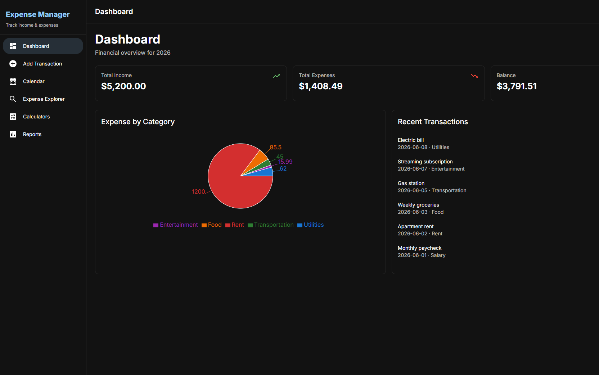
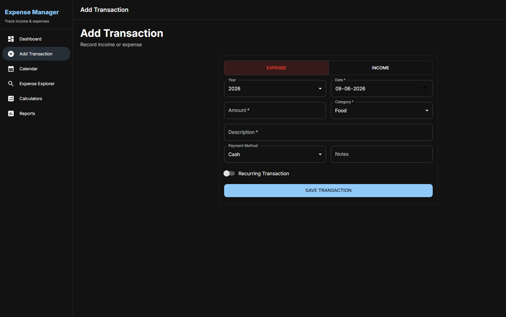
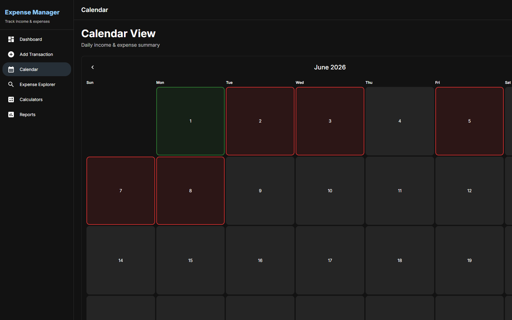
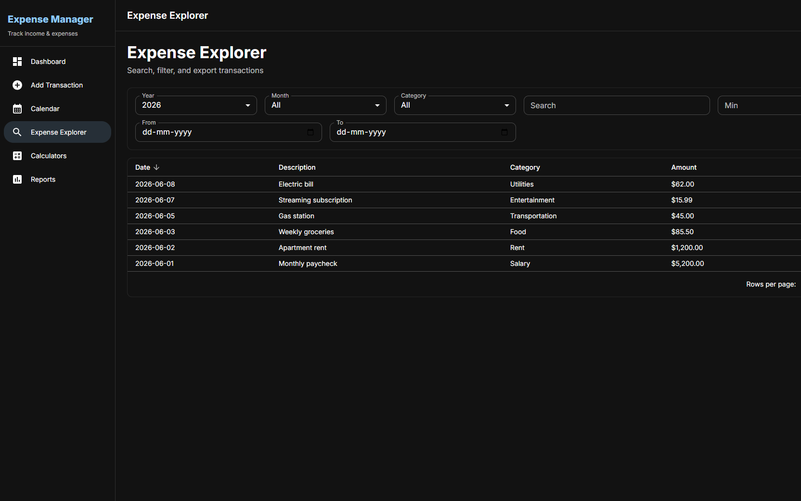
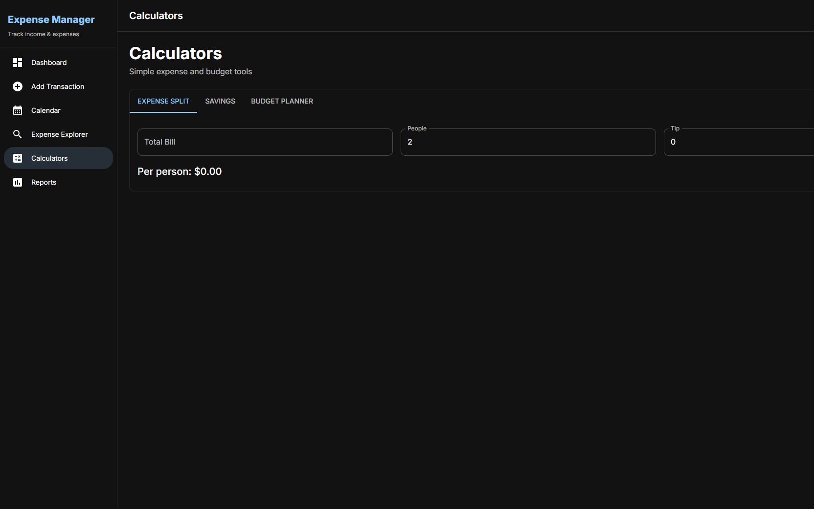
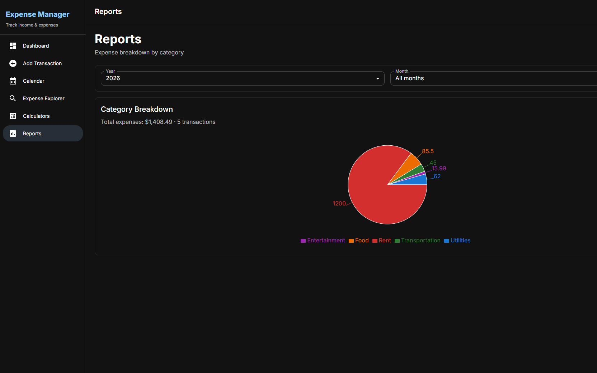
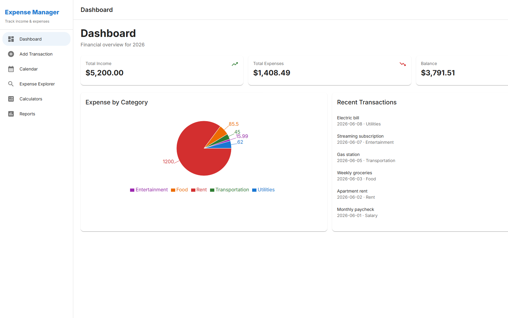

# Expense Manager

A modern, **offline-first** personal finance app to track income and expenses — entirely in your browser. No account, no server, no sign-up. Your data stays on your device.



---

## Table of Contents

- [Features](#features)
- [Screenshots](#screenshots)
- [Tech Stack](#tech-stack)
- [Architecture](#architecture)
- [Getting Started](#getting-started)
- [Available Scripts](#available-scripts)
- [Project Structure](#project-structure)
- [How Data Is Stored](#how-data-is-stored)
- [Deploy to Netlify](#deploy-to-netlify)
- [Browser Support](#browser-support)
- [License](#license)

---

## Features

| Feature | Description |
|---------|-------------|
| **Dashboard** | Yearly income, expenses, balance, category pie chart, and recent transactions |
| **Add Transaction** | Record income or expense with categories, payment method, notes, and recurring support |
| **Calendar** | Monthly view with color-coded days (income, expense, or mixed) and daily drill-down |
| **Expense Explorer** | Search, filter, sort, paginate, and export transactions to CSV or Excel |
| **Calculators** | Expense split, savings goal planner, and 50/30/20 budget calculator |
| **Reports** | Expense breakdown by category with interactive charts |
| **Dark / Light Mode** | Dark mode by default; toggle anytime from the header |
| **Offline & PWA** | Works without internet after first load; installable as a Progressive Web App |
| **Privacy** | All data stored locally in IndexedDB — nothing sent to a server |

---

## Screenshots

### Dashboard
Financial overview with summary cards, expense pie chart, and recent activity.


### Add Transaction
Simple form for income/expense entry with optional recurring transactions.



### Calendar
Color-coded monthly calendar — green for income, red for expenses, orange for mixed days.



### Expense Explorer
Powerful filtering, sorting, pagination, and CSV/Excel export.



### Calculators
Built-in tools for splitting bills, savings goals, and budget planning.



### Reports
Category breakdown chart filtered by year and month.



### Light Mode
Toggle between dark and light themes from the header.



---

## Tech Stack

| Category | Technology |
|----------|------------|
| **UI** | React 19, TypeScript, Material UI (MUI) 6 |
| **Build** | Vite 8 |
| **Routing** | React Router 7 (lazy-loaded routes) |
| **State** | Redux Toolkit |
| **Database** | IndexedDB via Dexie 4 |
| **Charts** | Recharts |
| **Dates** | Day.js |
| **Export** | SheetJS (xlsx), file-saver |
| **PWA** | vite-plugin-pwa |
| **Testing** | Vitest, Testing Library |

---

## Architecture

```
┌─────────────────────────────────────────────────────────┐
│                     React UI (Pages)                    │
│   Dashboard · Add Tx · Calendar · Explorer · Reports    │
└─────────────────────────┬───────────────────────────────┘
                          │ useAppSelector / dispatch
┌─────────────────────────▼───────────────────────────────┐
│                   Redux Store (in-memory)               │
│              transactions: { items, loading, error }    │
└─────────────────────────┬───────────────────────────────┘
                          │ async thunks (load / add)
┌─────────────────────────▼───────────────────────────────┐
│              IndexedDB — Dexie (persistent)             │
│         transactions · recurringRules                   │
└─────────────────────────────────────────────────────────┘
```

**How it works:**

1. On app load, `useInitializeApp()` dispatches `loadTransactions()`.
2. The thunk runs recurring transaction processing, then reads all transactions from IndexedDB.
3. Redux holds an in-memory copy for fast UI updates across all pages.
4. When you add a transaction, it is saved to IndexedDB first, then reflected in Redux.

**Theme** is managed with React Context (defaults to dark mode) — no server persistence needed.

---

## Getting Started

### Prerequisites

- [Node.js](https://nodejs.org/) 18 or later
- npm (comes with Node.js)

### Installation

```bash
# Clone the repository
git clone https://github.com/YOUR_USERNAME/smart-expense-manager.git
cd smart-expense-manager

# Install dependencies
npm install

# Start development server
npm run dev
```

Open the URL shown in the terminal (usually `http://localhost:5173`).

### Production Build

```bash
npm run build
npm run preview   # preview the production build locally
```

The built files are output to the `dist/` folder.

---

## Available Scripts

| Command | Description |
|---------|-------------|
| `npm run dev` | Start Vite dev server with hot reload |
| `npm run build` | Type-check and build for production |
| `npm run preview` | Serve the production build locally |
| `npm run test` | Run unit tests once |
| `npm run test:watch` | Run tests in watch mode |
| `npm run lint` | Run ESLint |
| `npm run format` | Format source files with Prettier |

---

## Project Structure

```
smart-expense-manager/
├── docs/
│   └── screenshots/          # README screenshots
├── public/
│   └── favicon.svg
├── src/
│   ├── app/
│   │   ├── App.tsx           # Root component & providers
│   │   └── theme/            # Dark/light theme context
│   ├── features/
│   │   ├── dashboard/        # Dashboard page
│   │   ├── transactions/     # Add, Calendar, Explorer pages
│   │   ├── calculator/       # Calculator tools
│   │   └── reports/          # Reports page
│   ├── shared/
│   │   ├── components/       # Reusable UI components
│   │   ├── constants/        # Categories, payment methods
│   │   └── layout/           # App shell (sidebar + header)
│   ├── hooks/                # useInitializeApp, useCurrency, redux
│   ├── routes/               # React Router config
│   ├── services/
│   │   ├── db/               # Dexie / IndexedDB setup
│   │   └── export/           # CSV & Excel export
│   ├── store/
│   │   └── slices/           # Redux transaction slice
│   ├── types/                # TypeScript interfaces
│   ├── utils/                # Finance, dates, recurring logic
│   └── main.tsx              # App entry point
├── index.html
├── package.json
├── vite.config.ts
└── README.md
```

---

## How Data Is Stored

All financial data is stored in your browser's **IndexedDB** (database name: `SmartExpenseDB`).

| Store | Contents |
|-------|----------|
| `transactions` | Every income and expense record |
| `recurringRules` | Rules for auto-generating recurring transactions |

**Important notes:**

- Data is **per browser, per device** — it does not sync across devices.
- Clearing browser site data will delete your transactions.
- There is no cloud backup unless you export via the Explorer page (CSV/Excel).

---

## Deploy to Netlify

This app is a static SPA — perfect for Netlify (or Vercel, GitHub Pages, etc.).

### Option 1 — Netlify UI

1. Push this repo to GitHub.
2. Go to [netlify.com](https://www.netlify.com) → **Add new site** → **Import from Git**.
3. Use these build settings:

| Setting | Value |
|---------|-------|
| Build command | `npm run build` |
| Publish directory | `dist` |

4. Add a `public/_redirects` file (for client-side routing):

```
/*    /index.html   200
```

5. Deploy.

### Option 2 — Netlify CLI

```bash
npm run build
npx netlify deploy --prod --dir=dist
```

No environment variables are required — the app has no backend.

---

## Browser Support

Works in all modern browsers that support IndexedDB:

- Chrome / Edge 90+
- Firefox 90+
- Safari 15+

---

## License

MIT — feel free to use, modify, and distribute.

---

## Author
Name: Kowshalya Gopinaidu Asokan

